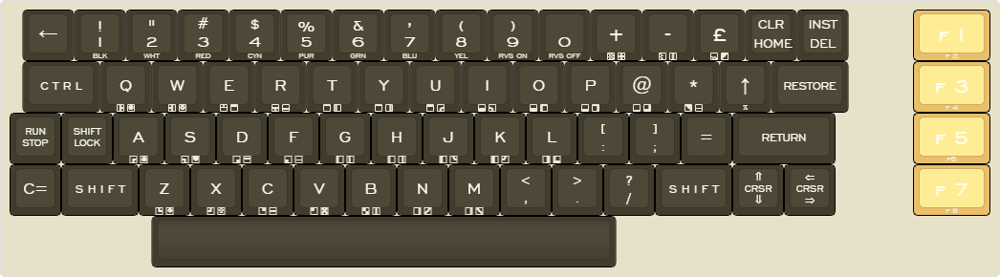
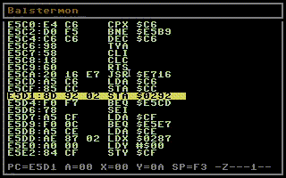
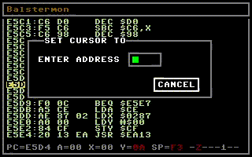
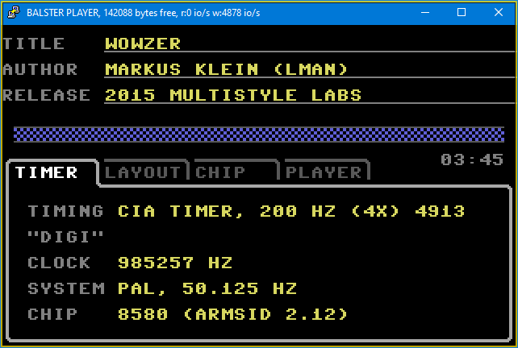
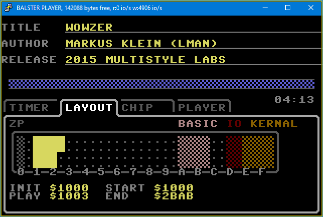
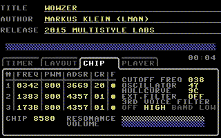
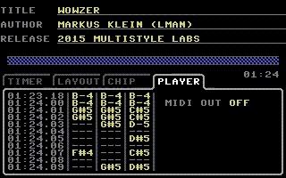

# Balster64
_hacking a C64 emulator into an ESP32 microcontroller_

## About

This was a fun project I did december 2019 without any purpose. 

It's an emulator of the C64 running on an ESP32. It is meant to output textmode only to a serial console and it can also drive a SID chip to output music.

## Features

- SD-CARD and Flash support
- Built-in file manager
- Built-in 6510 monitor with assembler and disassembler
- Built-in SID player

## Compile & Install

- read roms/README.md about the missing firmwares
- check config.h and platformio.ini for customizations

1) get an ESP32 and connect it to your computer through usb serial
2) open the project in VS code (https://code.visualstudio.com/)
3) install the platformio extension (https://platformio.org/)
4) build & upload to the connected ESP
5) use PuTTY to connect to the ESP32 (https://www.putty.org/)
    - 921600 baud
    - change to 40 x 25 size and set to "resize font"
    - use Pet Me 64 font, ie 12 point (ie from here https://www.kreativekorp.com/software/fonts/c64.shtml)
    (see included putty.session text file, copy it to ~/.putty/sessions/b64)

## Usage

- with CTRL-R you can reset the emulation
- device 8 is the SD-CARD, device 9 is the internal flash FS (LittleFS)
- connect to wifi and go to <ip address>/edit

### Debug Monitor
- F12 will open the monitor, ESC will close it
- F7 shows disassembler
- F8 shows ascii browser
- g : goto address. use this to browse at that address
- j : jump address. will set the PC
- UP/DOWN : scroll by line
- F1 : load memory
- F2 : save memory
- F11 : step into
- F10 : step over
- o : step out
- i : issue an irq and continue in IRQ handler
- +/- : add/remove breakpoint

With the "TAB" key you will start entering assembly code directly.
- if the editor is red, it can't be disassembled
- press return to enter next instruction
- ESC to leave immediate mode input

### Filebrowser
- device 1 is treated like device 8, so you can omit the ",8"
- if you just execute LOAD it will open a filebrowser
- F1 selects SD-CARD, F2 selects internal flash FS
- SPACE key selects files
- F7 will create a directory
- F5 will copy selected files from current device to other device (SD-CARD or flash fs)
- RETURN will load the file
- .SID files will be played directly using the built-in SID player
- you can mount .T64 and .D64 archives just by loading them, ie LOAD"DISK.D64"
  - a single LOAD will unmount
  

### SID-Player
- F1/F2/F3/F4 switch through the pages
- o : open another file
- F5 : play next song, if a playlist exists (see below)
- F6 : save current playlist
- F7 : add current song to playlist
- 1/2/3 : mute individual voices
- +/- : switch song number
- 6 : select 6581
- 8 : select 8580
- n : select NTSC
- p : select PAL

### Keyboard via Terminal

- **Pound**: CTRL-C + l
- **Pi**: CTRL-C + p
- **arrow left** : _
- **arrow up** : ^
- **BLK** : CTRL-C + 1
- **WHT** : CTRL-C + 2
- **RED** : CTRL-C + 3
- **CYN** : CTRL-C + 4
- **PUR** : CTRL-C + 5
- **GRN** : CTRL-C + 6
- **BLU** : CTRL-C + 7
- **YEL** : CTRL-C + 8
- **RVS ON**: CTRL-C + 9
- **RVS OFF**: CTRL-C + 0
- **RUNSTOP+RESTORE** : TAB
- **RUNSTOP** : ESCAPE

Special Keystrokes:
- **CTRL-D** : refresh
- **CTRL-G** : toggle upper/lowercase
- **CTRL-H** : toggle ANSI mode
- **CTRL-R** : soft reset

## POLL mode
This is the default for refreshing the screen. The emulator keeps a copy of text and color ram and checks every 20ms if something has changed. If yes, it will send delta updates to the console (sets cursor, changes color, prints characters). This is the most accurate representation of the C64.

## ANSI mode 
You can toggle between POLL and ANSI mode by typing **CTRL-H**. ANSI mode intercepts the KERNAL and tries to mimic keyboard pressed, navigation and screen output with regular ANSI sequences just as they happen. This can be very fast but is most of the time inaccurate. 

# Hidden Commands

LOAD -> opens file manager
LOAD"%" -> some status prints
VERIFY"WIFI" (or short: vE"wifi) -> enables wifi

# Monitor
You can enter the built-in machine language monitor by pressing **F12**; leave that mode with **ESCAPE**.

- it stops at the current CPU program counter
- browse with cursor up and down, page up and down
- press **i** to trigger an interrupt
- **+** and **-** let's you set a breakpoint at the cursor. 
- type **g** to _goto_ to an address (view from there)
- type **j** to _jump_ to an address (continue from there)

- you can also enter machine language directly, just hit the **tab** key
- ESCAPE let's you exit direct input
- if the input line is understood, it is shown in yellow
- otherwise it will be shown in red

# Player
## Playlist
- press **o** to open another song with the file browser
- **F5** will play the next entry from the playlist
- **F6** will save the current playlist to disk
- **F7** will add the currently played song to the playlist in memory
The playlist is a complete desaster and needs to be rewritten, it needs a UI editor, working shuffle mode, endless mode, easy adding and removing, and much more.

Most important is a headless mode: right now the whole emulator needs a connected tty to function.

## Tabs

press **F1** for the timer tab

This page will show you timing information about the loaded song.
If you have an ARMSID it will set the chip type automatically, and the chip frequency will be generated by the ESP32.

press **F2** for the memory tab

This shows the memory map of the C64, the banks and where the song has been loaded to

press **F3** for the register viewer

This shows the values of the various SID chip registers in real-time. 

press **F4** for an experimental note viewer

This tries to display the keyed voices like a tracker would do. Maybe I'll do some code to forward the evens in real-time to a connected MIDI interface, who knows.

# kernal hacks

